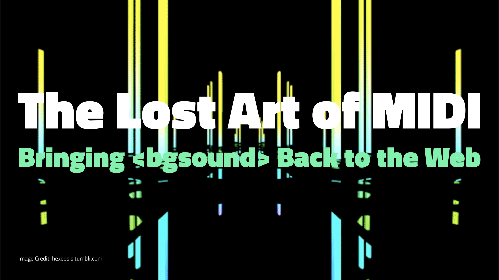

# bg-sound

[![travis][travis-image]][travis-url] [![npm][npm-image]][npm-url] [![downloads][downloads-image]][downloads-url] [![javascript style guide][standard-image]][standard-url]

[travis-image]: https://img.shields.io/travis/feross/bg-sound/master.svg
[travis-url]: https://travis-ci.org/feross/bg-sound
[npm-image]: https://img.shields.io/npm/v/bg-sound.svg
[npm-url]: https://npmjs.org/package/bg-sound
[downloads-image]: https://img.shields.io/npm/dm/bg-sound.svg
[downloads-url]: https://npmjs.org/package/bg-sound
[standard-image]: https://img.shields.io/badge/code_style-standard-brightgreen.svg
[standard-url]: https://standardjs.com

### Web Component to emulate the old-school `<bgsound>` HTML element

Play MIDI files in a browser with a simple Web Component, emulating
[`<bgsound>`, the Background Sound element](https://developer.mozilla.org/en-US/docs/Web/HTML/Element/bgsound).

## Install

```
npm install bg-sound timidity freepats
```

## Usage

```html
<bg-sound src="sound.mid"></bg-sound>
<script src="bg-sound.min.js"></script>
```

## Talk

I introduced this project in a talk at [JSConf Colombia 2018](https://jsconf.co/).

[](https://speakerdeck.com/feross/the-lost-art-of-midi-bringing-back-to-the-web)

- [Slides](https://speakerdeck.com/feross/the-lost-art-of-midi-bringing-back-to-the-web)
- Talk video (coming soon!)

## FAQ

### Why is the tag called `<bg-sound>` (with a dash)?

The name of a custom HTML element must contain a dash (-). This is what the spec says, presumably because otherwise browsers could not introduce new HTML tags without web compatibility risk.

### Why is the script tag required?

The script tag is needed to define the behavior of the `<bg-sound>` HTML element. Without it, the browser would just treat the tag like a `<div>`.

### Why are the `timidity` and `freepats` packages required?

The `<bg-sound>` custom element lazily loads a WebAssembly file and instrument
sounds at runtime.

The [`timidity`](https://github.com/feross/timidity) package provides the WebAssembly file (`libtimidity.wasm`). The
`freepats` package provides the instrument sound files.

It's important to ensure that the `timidity` and `freepats` folders in
`node_modules` are being served to the public. For example, here is how to mount
the necessary files at `/` with the `express` server:

```js
const timidityPath = path.dirname(require.resolve('timidity'))
app.use(express.static(timidityPath))

const freepatsPath = path.dirname(require.resolve('freepats'))
app.use(express.static(freepatsPath))
```

Optionally, provide a `baseUrl` attribute to customize where the player will
look for the lazy-loaded WebAssembly file `libtimidity.wasm` and the
[FreePats General MIDI soundset](https://www.npmjs.com/package/freepats) files.
The default `baseUrl` is `/`.

```js
<bg-sound src="sound.mid" baseUrl="/custom-path"></bg-sound>
```

## Demo

If you like this, then check out [BitMidi.com](https://bitmidi.com), the wayback machine for old-school MIDI files! Check out some examples MIDIs here:

- [Adele - Skyfall](https://bitmidi.com/adele-skyfall-mid)
- [Beatles - Imagine](https://bitmidi.com/beatles-imagine-mid)
- [Beyonce - Crazy in Love](https://bitmidi.com/beyonce-crazy-in-love-mid)
- [CANYON.MID](https://bitmidi.com/canyon-mid)
- [Cowboy Bepop - Space Lion](https://bitmidi.com/cowboy-bepop-space-lion-mid)
- [Eiffel 65 - Blue](https://bitmidi.com/dj-ali-eiffel-blue-mid)
- [Kingdom Hearts - Dearly Beloved](https://bitmidi.com/kingdom-hearts-dearly-beloved-mid)
- [Mario Bros. - Super Mario Bros. Theme](https://bitmidi.com/mario-bros-super-mario-bros-theme-mid)
- [Passenger - Let Her Go](https://bitmidi.com/passenger-let_her_go-mid)
- [Portal - Still Alive](https://bitmidi.com/portal-still-alive-mid)
- [Rick Astley - Never Gonna Give You Up](https://bitmidi.com/r-astley-never-gonna-give-you-up-k-mid)
- [Simpsons Theme Song](https://bitmidi.com/simpsons-mid)
- [Sonic the Hedgehog - Green Hill Zone](https://bitmidi.com/sonic-the-hedgehog-green-hill-zone-mid)
- [TOTO - Africa](https://bitmidi.com/toto-africa-k-mid)

## License

MIT. Copyright (c) [Feross Aboukhadijeh](https://feross.org).
